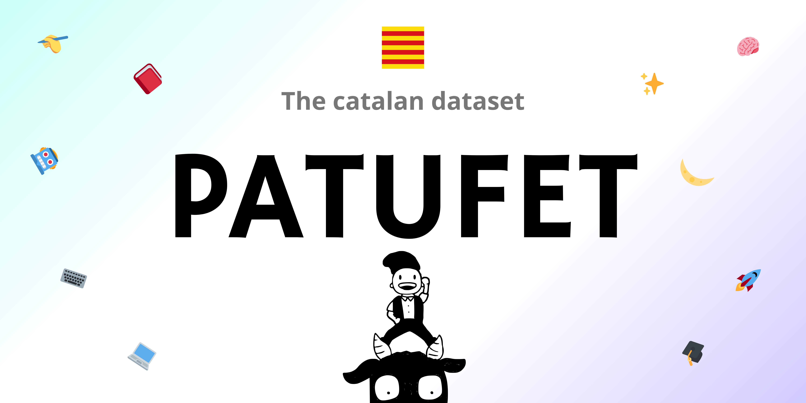

<!--- BADGES: START --->

<!--- BADGES: END --->

# patufet
> The catalan datasets. 

    
    
Image generated by DALL-E, the <a href="https://huggingface.co/datasets/HuggingFaceTB/miscellaneous/blob/main/cosmopedia_dalle_prompt_by_mixtral.txt">prompt</a> was generated by Mixtral-8x7B-Instruct-v0.1.

> [!NOTE]
> Still under development :)

## Description

This repo contains the code used to create the whole patufet series of Catalan textual data for LLM training. This includes filtered crawls, synthetic data...

The aim for this project was to create good quality datasets that could cover all the aspects for LLMs training data in a mid/low-resource language like Catalan, which didn't have a lot of content. There are some datasets more tailored to pretraining, but also some intended for finetunning (both instruct and chat).

## Datasets

Each folder contains the code used to generate each different dataset. These are:

### Patufet-educat 🎓
> https://huggingface.co/datasets/pauhidalgoo/patufet-educat

This dataset was inspired by the [fineweb-edu](https://huggingface.co/datasets/HuggingFaceFW/fineweb-edu) dataset. The idea was to filter the [Cultura-X](https://huggingface.co/datasets/uonlp/CulturaX) crawl based on educational content.

The content of the folder has the scripts used to score 100.000 samples ([oscar-annotations](https://huggingface.co/datasets/pauhidalgoo/oscar-ca-annotations)), train a Fast-text model and tag the complete crawl. 

### Patufet-textbooks 📚
> https://huggingface.co/datasets/pauhidalgoo/patufet-textbooks

During the creation of patufet-educat, we found out that there was very few data which was educational enough in catalan. This lead to the creation of this second dataset.

Inspired by the [textbooks-are-all-you-need](https://arxiv.org/abs/2306.11644) and [textbooks-are-all-you-need-II](https://arxiv.org/abs/2309.05463) papers from Microsfot Research, we used [Gemini-1.5-flash](https://ai.google.dev/gemini-api) model from Google to generate +270.000 textbooks-like chapters on a wide range of topics and audiences. This repo contains all the code used + a json with the topics. More information can be found at the huggingface dataset card.

### Patufet-stories 🌙
> https://huggingface.co/datasets/pauhidalgoo/patufet-stories

Using [Gemini-1.5-flash](https://ai.google.dev/gemini-api) again, we generated 200.000 synthetic stories in catalan. The [TinyStories](https://arxiv.org/abs/2305.07759) paper showcased how with this kind of text, one could train a very small model to generate coherent and consistent text. In this case, the synthetic generation was seed based from the [oscar-2301](https://huggingface.co/datasets/oscar-corpus/OSCAR-2301) dataset.

### Patufet-code 👨‍💻
> https://huggingface.co/datasets/pauhidalgoo/patufet-code

Another area where we found that there wasn't enough data was on code. Most of the available code datasets contain english-only comments. In the corresponding folder, you will find a script to generate 65.000 examples of synthetic, commented in catalan code (also made by [Gemini-1.5-flash](https://ai.google.dev/gemini-api)). Learning to code can improve an LLM math skills and also causal reasoning (see, for example, [the-magic-of-if](https://aclanthology.org/2023.findings-acl.574.pdf)).

### Patufet-QA ❓
> https://huggingface.co/datasets/baiges/patufet-QA

This dataset contains more than 500.000 questions and answers. It was created based on patufet-textbooks, and it is also synthetic from the same model. 

The use of patufet-textbooks as a base for the questions ensured that they cover the wide range of 1804 subtopics that it includes.

### Patufet-IT 📋
> https://huggingface.co/datasets/baiges/patufet-IT

Containing instructions, this dataset has two main components: for starters, some of the entries are related to generating stories based on the patufet-stories dataset. The other ones come from [alpaCAT](./alpaCAT/). This second dataset is basically the translation of [alpaca-cleaned](https://huggingface.co/datasets/yahma/alpaca-cleaned) by yahma, a cleaned version of the original Alpaca dataset ([their Github repo](https://github.com/gururise/AlpacaDataCleaned)). 

### Patufet-conversa 🗣️
> https://huggingface.co/datasets/pauhidalgoo/patufet-conversa

Using again [Gemini-1.5-flash](https://ai.google.dev/gemini-api), and based on +300 topics and +20 instruction styles, we generated multiturn conversations of an User and an AI. These conversations were also formatted so they can be used directly with the [SFT Trainer](https://huggingface.co/docs/trl/sft_trainer).

It was based, a bit, on the [UltraChat](https://github.com/thunlp/UltraChat) dataset, also available [on this repo](https://github.com/thunlp/UltraChat).

### Patufet-human-interactions 🧍‍♂️
> https://huggingface.co/datasets/baiges/patufet-human-interactions

After analyzing the IT dataset, we detected that the models trained on it lacked self-awareness and the hability to answer day-to-day messages (very simple requests, weird prompts, greetings...) To solve this issue, we created this small dataset just so the model knew a bit how to answer in this kind of situations.

### Patufet-escrits ✒️
> https://huggingface.co/datasets/pauhidalgoo/patufet-escrits

We had a lot of data showing the model how to write stories, but other writing styles were underrepresented. This dataset aims to solve this problem by incorporating 9 more types of texts, from emails to linked-in posts, to improve a models writing habilities. Note that, since we liked a lot the idea of making poems with an LLM, there are a lot of poem examples compared to the other types.

----------------

Other folders contain the code to for example, translate Hellaswag or AlpacaCAT, or just images.

For a more extensive description of each dataset, visit it's huggingface.

## Use examples

The datasets from above have been used to train the following list of models:
- [CatGPT](https://huggingface.co/baiges/CatGPT)
- [cucafera](https://huggingface.co/pauhidalgoo/cucafera)
- [cucafera-instruct](https://huggingface.co/pauhidalgoo/cucafera-instruct)
- [cucafera-chat](https://huggingface.co/pauhidalgoo/cucafera-chat)

## To-Do / Future work 

We have created a lot of different datasets, but we still think there are ways to improve them. For example, we miss the following datasets:
- [ ] Patufet-maths
- [ ] Patufet-DPO
- [ ] Patufet-info (about himself, the creators...)
- [ ] Patufet-safety
- [ ] Patufet-reasoning
- [ ] Patufet-reflection (inspired by [Reflection Llama 3.1](https://huggingface.co/mattshumer/Reflection-Llama-3.1-70B))

Also, the datasets we already have can be improved by:
- Using open source models to generate the synthetic data (we used Gemini Flash because we didn't have money and we are GPU poor)
- The code dataset lacks variability -> another idea that we had was to use some preexisting code dataset (like the stack) and simply translate the comments
- Filtering the wrong answers from the datasets
  - The easiest one would be the patufet-code (just filter the code that works). We tried it, but we ran into some problems and in the end we didn't do it

## License

All the datasets that are synthetic data (which are generated by Gemini-1.5-flash), must follow the [Gemini-TOS](https://ai.google.dev/gemini-api/terms) and cannot be used to develop models that compete with Google Services.

For patufet-educat, since it comes from CulturaX, you must follow the [mC4](https://huggingface.co/datasets/allenai/c4#license) and [OSCAR](https://huggingface.co/datasets/oscar-corpus/OSCAR-2301#licensing-information) licenses.
